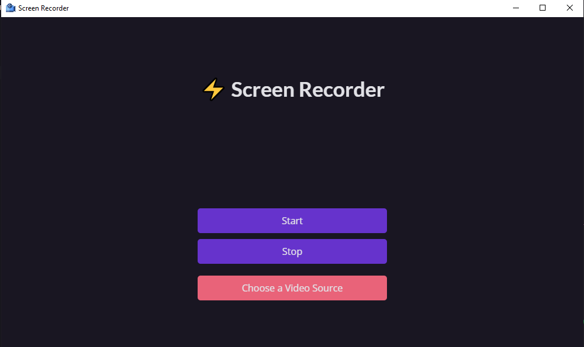

<div align="center">

# Electron Screen Recorder

⚡ A app built made in Electron with Javascript

</div>

<div align="center">

  
  

</div>

---
## Technologies used 🛠

- Web Technologies (HTML, CSS, JS)
- Electron
- Electron API (Remote, desktopCapturer, dialog)
- Eslint API
- prettier

## How to Fork the project and contribute 💪

```
# Create a new branch with your changes:

$ git checkout -b <branch>
```

```
# Save your changes and create a commit message telling you what you did:

$ git commit -m "<commit>"
```

```
# Submit your changes:

$ git push origin <branch>
```
---

### How to run locally 🤔

```
# Clone repository

$ git clone https://github.com/r3nanp/electron-screen-recorder.git
```

```
# At the root of the project, run:

yarn or npm install
```

```
# To run the app in your machine:

yarn dev:electron or npm run dev:electron
```

```
# Make the app to your operating system

yarn make or npm run make
```

### Download

<a href="https://github.com/r3nanp/electron-screen-recorder/releases/tag/1.3">Download</a>

### Screenshot

  

### Typescript + React version (not completed)

<a href="https://github.com/r3nanp/electron-typescript-screen-recorder">TS Version</a>
